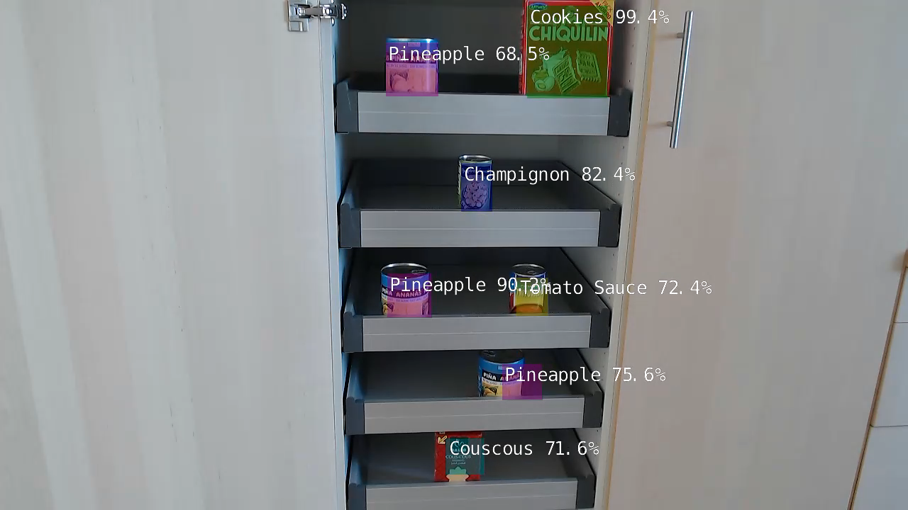
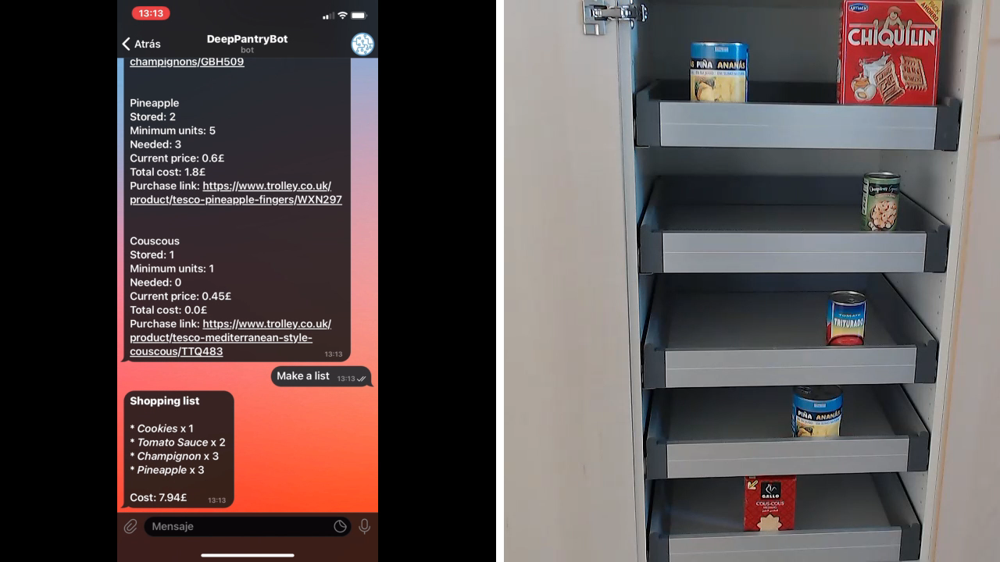
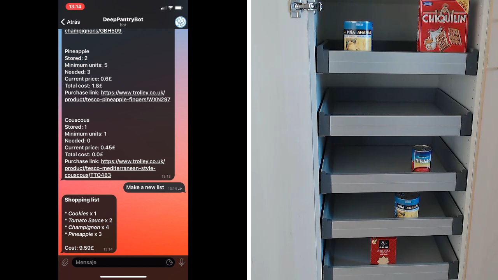

# DeepPantry
Let AI keep track of your food inventory and handle the shopping list for you




## Author
- [@AndPerCast](https://github.com/AndPerCast)

## License
[MIT](https://choosealicense.com/licenses/mit/)

<br>

## Overview
[Video Introduction](https://drive.google.com/file/d/1efLKcKvvl4lJusevOCURmUpihAO0zjJ6/view?usp=sharing)

This project allows you to create an smart home device, which can manage your<br>
food inventory and make a shopping list at your convenience.

**DeepPantry** uses [machine learning](#ai-models) to identify several types of objects, from<br>
an image of your pantry. With the help of a Telegram chat interface, you can<br>
specify the required stock for each product and ask for a list with real-time prices.
Sample output | Sample output
:-------:|:-------:
 | 

<br>

## Motivation
Nowadays, efficient food resources management has become even more important<br>
for our society. I realized that some household appliance manufacturers have<br>
tried to tackle this problem from AI's perpective, by using image recognition.<br>
Therefore, I thought I was a good idea to create a similar project.

I chose [Nvidia Jetson Nano](https://developer.nvidia.com/embedded/jetson-nano-developer-kit) as hardware support. Although there might be better<br>
alternatives to solve this task, such as an IOT schema with a microcontroller and<br>
a centralized computing server, *edge computing* offers a crucial upside.

Such advantage is personal privacy, as anyone who has access to the data could<br>
extract information about our eating habits and purchasing power, which could<br>
be very profitable for advertising companies.

In my case, security concerns are covered. Both data gathering and processing<br>
are done locally on Jetson Nano. Internet connection is necessary just to<br>
present results to user.

If you want to see how I faced AI training, check [this](#ai-models) section.

<br>

## Requirements
- Nvidia Jetson Nano
- Micro SD card (64 GB recommended)
- Power supply (according to your device)
- CSI/USB camera

> Jetson Nano 4GB was used to build this project, however, 2GB version<br>
> should work as well. If you experiment issues, follow [these](https://github.com/dusty-nv/jetson-inference/blob/master/docs/pytorch-transfer-learning.md#disabling-the-desktop-gui) or [these](https://github.com/dusty-nv/jetson-inference/blob/master/docs/pytorch-transfer-learning.md#mounting-swap) steps.

> If you opt for 4GB version, you definitely need to consider barrel jack.

### Optional
- USB keyboard and mouse
- HMDI monitor
- Camera tripod
- USB wifi adapter

> This project requires a permanent Internet connection, in order to present<br>
> results to the user.

<br>

## Installation guide
First of all, you have to complete the [initial set up](https://developer.nvidia.com/embedded/learn/get-started-jetson-nano-devkit) of your Jetson Nano, which<br>
includes flashing the OS image on your SD card.

> This project has been tested under **JetPack 4.6.1**

Once you boot up, update your system and proceed to clone this repository,<br>
using following commands:

```bash
  sudo apt update
  sudo apt upgrade
  git clone https://github.com/AndPerCast/DeepPantry.git
```

It's time to configure the project:
- [Application settings](#settings)
- [AI models](#ai-models)

The best way to run the project is via a **Docker container**. There is a simple<br>
*Dockerfile* located on **project's root directory**, which you can further<br>
customize if you plan to enhance this application.

You can either build a local image or pull it from [Docker Hub](https://hub.docker.com/r/andpercast/deep-pantry).<br>
There is a script called [run_app.sh](config/CONFIG.md#run-docker-container) to execute main application inside a<br>
container. For example:

> You need to exert sudo priviledges if you are not a member of [docker group](https://docs.docker.com/engine/install/linux-postinstall/#manage-docker-as-a-non-root-user).

> Make sure that you have plugged your camera to the Jetson and it points to<br>
> the right place.

```bash
  pwd
  # <...>/DeepPantry

  # If you choose to build a local image.
  docker build . -t deep-pantry
  config/run_app.sh deep-pantry

  # Else, make sure to specify a proper image tag.
  config/run_app.sh andpercast/deep-pantry:latest
```

Finally, head over to Telegram and start interacting with the chatbot.<br>
The `/help` command will help you to get started.

<br>

## API documentation
You can find more information about API documentation [here](docs/DOCS.md).

<br>

## Settings
You can find more information about project settings [here](config/CONFIG.md).

<br>

## AI models
You can find more information about supported AI models [here](models/MODELS.md).

<br>

## Testing
You can find more information about project testing [here](tests/TESTS.md).